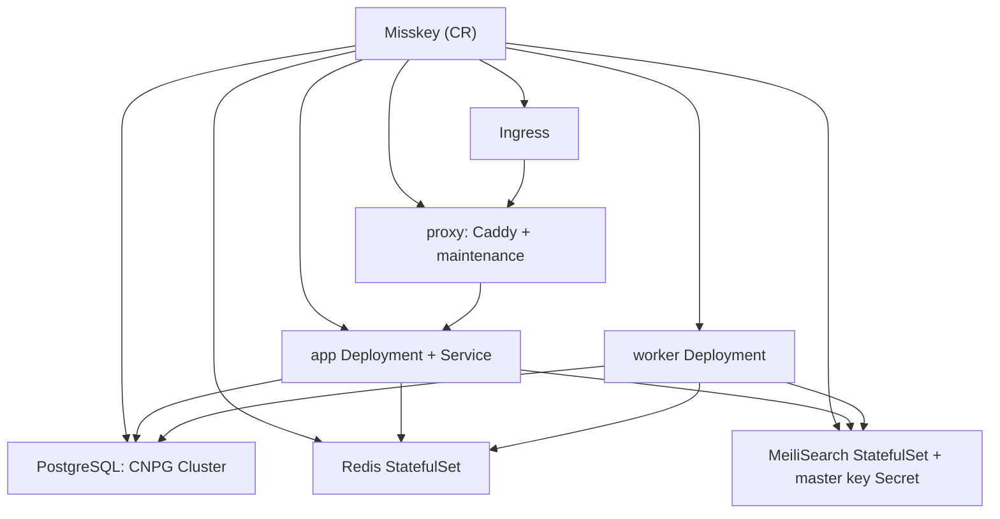

# CloudNativeMisskey

Kubernetes上でMisskeyインスタンスを宣言的に管理するOperatorです。1つの`Misskey`カスタムリソースから、app/worker/proxy/Redis/MeiliSearch/PostgreSQL/Ingressまでを生成します。

全文検索はMeiliSearchを既定にしています。`search.provider`で`sqlPgroonga`/`sqlLike`も選べます。

## アーキテクチャ



## コンポーネント

- **app**(`MK_ONLY_SERVER=true`)と**worker**(`MK_ONLY_QUEUE=true`)は同一imageを共有します。initContainerで`built/`をwritableなemptyDirにコピーし、`default.yml`の`${DB_PASSWORD}`/`${MEILI_KEY}`/`${REDIS_PASSWORD}`系/`${SETUP_PASSWORD}`をNodeスクリプトのリテラル置換(JSON quote)で展開します。シークレット値はConfigMapに載らず、改行や`#`等を含む値でもYAMLとして安全です。
- **proxy**はCaddyでappに転送し、backend down時はmaintenanceにfallbackします。`proxy.enabled: false`で無効化でき、そのときIngressはappを直接指します。TLS終端は前段に委ねる前提で、plain HTTPで動きます。
- **Redis**は`redis:8-alpine`(Redis 8を要件とする)を使い、`maxmemory`(既定400mb)と`maxmemory-policy`(既定`noeviction`)を設定し、job queue耐久化のためAOFを既定で有効にします。`redis.external`で外部参照もできます。
- **MeiliSearch**のmaster keyは、未指定なら自動生成して`<name>-meilisearch` Secretに保存します。
- **PostgreSQL**はCNPGの`Cluster`を生成します。app用の認証情報`<name>-db-app` SecretはCNPGが払い出し、Misskeyはそこからパスワードを読みます。`postgres.external`で外部DB参照もできます。

## 前提

| 依存 | 用途 | 必須 |
|---|---|---|
| CloudNativePG operator | `spec.postgres`をCNPGで管理する場合 | DB managed時のみ |
| OT-CONTAINER-KIT redis-operator | `spec.redis.ha`のSentinel HA | redis HA有効時のみ |
| KEDA | `spec.worker.autoscaling.queues`のキュー深度スケール | worker queueスケール時のみ |
| metrics-server | `spec.app.autoscaling`のCPU/memory HPA | app HPA有効時のみ |
| Prometheus Operator | `spec.monitoring`のServiceMonitor/PodMonitor | monitoring有効時のみ |
| Ingress controller | `spec.ingress`公開(nginx/traefik等) | ingress有効時のみ |
| RWO StorageClass | Redis/MeiliSearch/PostgreSQLのPVC | managed時のみ |

`postgres.external`/`redis.external`/`search.meilisearch.external`を使えば、これらを外部参照にしてOperator管理から外せます。

redis-operatorとKEDAはCNPG同様に別途インストールします:

```bash
helm install redis-operator ot-helm/redis-operator -n redis-operator --create-namespace
helm install keda kedacore/keda -n keda --create-namespace
```

> [!IMPORTANT]
> network isolation併用時、`network.isolation.enabled=true`(既定)のままredis HAやworker queueスケールを使う場合、redis-operator/KEDAがredisへ到達できるよう、それらのnamespaceを`spec.network.isolation.allowedNamespaces`に必ず含めてください。未設定だとoperator/KEDAがredisに届かずHA/スケールが立ち上がりません。managed HA redisはrequirepass認証も付くため、network到達可否に関わらずデータ自体は保護されます。

## インストール

```bash
# リリース添付のinstall manifestを直接適用(CRD+RBAC+controller manager)
kubectl apply -f https://github.com/chan-mai/cloud-native-misskey/releases/latest/download/install.yaml
# webhook入り(cert-manager必須)
kubectl apply -f https://github.com/chan-mai/cloud-native-misskey/releases/latest/download/install-webhook.yaml
```

ソースからの適用:

```bash
# CRD+RBAC+controller managerを一括適用
make deploy IMG=ghcr.io/chan-mai/cloud-native-misskey:v0.1.0
# CRDのみ入れる
make install
```

イメージのbuild/push:

```bash
make docker-build docker-push IMG=ghcr.io/chan-mai/cloud-native-misskey:v0.1.0
```

## 使い方

```bash
kubectl apply -f config/samples/misskey_v1alpha1_misskey.yaml
kubectl get misskey
# NAME      URL                            SEARCH        PHASE     READY   AGE
# example   https://misskey.example.com/   meilisearch   Running   True    30s
```

`phase`は`Progressing`(subsystem未達)/`Running`(全達)/`Error`(reconcile失敗)の3値です。詳細な条件は`conditions`(`DatabaseReady`/`MigrationComplete`/`AppReady`/`WorkerReady`/`ProxyReady`/`IngressReady`と集約`Ready`)で確認します。解決済みの接続先は`kubectl get misskey -o wide`(`Database`/`Index`列)か`status`(`databaseHost`/`redisHost`/`searchIndex`)に出ます:

```bash
kubectl get misskey example -o jsonpath='{.status.databaseHost}{"\n"}'
# example-db-pooler-rw   (pooler有効時。無効なら例-db-rw、externalならそのhost)
```

`setupPassword`を自動生成させた場合、初回admin登録に使う値は次のように取り出します:

```bash
kubectl -n <namespace> get secret <name>-setup \
  -o jsonpath='{.data.SETUP_PASSWORD}' | base64 -d ; echo
```

最小構成:

```yaml
apiVersion: cloudnative-misskey.dev/v1alpha1
kind: Misskey
metadata:
  name: example
spec:
  url: https://misskey.example.com/
  image: misskey/misskey:2026.6.0
  app: { replicas: 3 }
  worker: { replicas: 2 }
  setupPassword: {}
  search:
    provider: meilisearch
    meilisearch: { storage: 10Gi }
  postgres: { instances: 2 }
  ingress: { className: nginx, host: misskey.example.com }
```

完全な例は[`config/samples/`](config/samples/)を参照してください。`misskey_v1alpha1_misskey.yaml`が全部入り、`_external.yaml`が外部DB/Redis/MeiliSearch参照の例です。

## spec主要フィールド

| フィールド | 既定 | 説明 |
|---|---|---|
| `url` | (必須) | 公開URL。初期化後は変更不可 |
| `image` | (必須) | Misskeyのimage。app/worker共通 |
| `idGenerationMethod` | `aidx` | ID方式。初期化後は変更不可 |
| `deletionPolicy` | `Delete` | CR削除時のデータ資源(CNPG/Redis/Meili/生成key Secret)の扱い。`Retain`でownerRefを外しデータ保持(同名CR再作成で再adopt) |
| `tenant` | namespace名 | 全リソース/podに付く`cloudnative-misskey.dev/tenant`ラベル値。ログ/メトリクスのテナント振り分け用。初期化後は変更不可 |
| `setupPassword` | (なし) | 初回admin登録用パスワード。`secretRef`指定か、未指定なら`<name>-setup` Secretへ自動生成 |
| `app.replicas`/`worker.replicas` | 1 | レプリカ数(autoscaling有効時は無視) |
| `app.autoscaling`/`worker.autoscaling` | (なし) | オートスケール。詳細は[スケーリング](#スケーリングオートスケール) |
| `search.provider` | `meilisearch` | `meilisearch`/`sqlLike`/`sqlPgroonga` |
| `search.meilisearch.scope` | `local` | `local`(自鯖のみ)/`global`(リモート含む) |
| `search.meilisearch.storage` | `10Gi` | MeiliSearchのPVCサイズ |
| `redis.maxMemory` | `400mb` | Redisの`--maxmemory` |
| `redis.maxMemoryPolicy` | `noeviction` | `--maxmemory-policy`。queue保護のため既定noeviction。純cache用途なら`allkeys-lru`推奨(下記ロール分離参照) |
| `redis.ha` | (なし) | Sentinel HA(opt-in)。redis-operator必須。requirepass認証+専用NP付き。詳細は[Redis HA/ロール分離](#redis-haロール分離) |
| `redis.roles` | (なし) | `jobQueue`/`pubsub`/`timelines`/`reactions`を役割別Redisに分離(opt-in) |
| `postgres.instances` | 1 | CNPGインスタンス数。2以上でHA |
| `postgres.readOffload` | instances>=2で自動 | replicaへread振り分け(`dbReplications`)。`false`でopt-out |
| `postgres.pooler` | (なし) | CNPG PgBouncer pooler(rw/ro)をopt-inで前段化 |
| `postgres.backup` | (なし) | barmanObjectStoreバックアップ。`schedule`指定でScheduledBackup |
| `migration.createIndexConcurrently` | `false` | `true`で`MISSKEY_MIGRATION_CREATE_INDEX_CONCURRENTLY=1`。note等の巨大表index作成の書込ロックを避ける(opt-in) |
| `proxy.enabled` | `true` | Caddy proxyの有無 |
| `ingress.className` | `nginx` | ingressClassName |
| `network.isolation.enabled` | `true` | backend(app/worker/redis/meili)へのingressをintra-instanceに限る。公開入口(proxy)とpostgres(CNPGに委任)は対象外 |
| `network.isolation.allowedNamespaces` | (なし) | backendへの到達を追加で許すnamespace名。監視namespaceからのscrape等 |
| `network.egressIsolation.enabled` | `false` | egress隔離(opt-in)。app/workerはpublic可、他backendはintra+DNSのみ。postgresは除外 |
| `network.egressIsolation.dnsNamespace` | `kube-system` | egress隔離時に`:53`を許すDNS namespace |
| `tenancy.dedicated` | `false` | namespace占有宣言。`quota`(ResourceQuota)/`limitRange`(LimitRange)生成の前提 |
| `monitoring.enabled` | `false` | PostgreSQL/Redis/MeiliSearchのServiceMonitor/PodMonitorを生成(opt-in, Prometheus Operator必須)。Redisはexporter、Meiliは`/metrics`を自動有効化。`monitoring.labels`でPrometheus selector合わせ |
| `extraConfig` | (なし) | `default.yml`末尾に追記する生YAML |

## フォークイメージ

`spec.image`にフォークのimageを指定すれば、(構造がupstream準拠の物に限り)Misskey系フォークがそのまま動作します。固有のconfigキーは`extraConfig`で追加可能です。

image契約(uid/コマンド/パス/health)がupstreamと異なるフォークは`spec.runtime`で上書きします。全て任意で、既定はupstream `misskey/misskey`です。

| `runtime`フィールド | 既定 | 用途 |
|---|---|---|
| `runAsUser` | `991` | コンテナuid |
| `startCommand` | `["pnpm","run","start"]` | app/worker起動コマンド |
| `migrateCommand` | `["pnpm","run","migrate"]` | migration Jobコマンド |
| `healthPath` | `/api/server-info` | probeパス |
| `configPath` | `/misskey/.config/default.yml` | `default.yml`のmount先 |
| `builtPath` | `/misskey/built` | `built/`のwritableコピー先。空文字でコピー無効 |

例(uidと起動コマンドが異なるフォーク):

```yaml
spec:
  image: ghcr.io/example/misskey-fork:1.0.0
  runtime:
    runAsUser: 1000
    startCommand: ["node", "packages/backend/built/entry.js"]
```

設定描画は常にMisskeyの`default.yml`形式です。またrender initはimage内のnodeを使うため、nodeを持たないimageには対応しません。

## GitOpsでの利用

ArgoCDやFlux等で配布する場合、Operator本体(`config/default`相当)を1つのApplication/Kustomizationとして同期し、各インスタンスは`Misskey` CRを1枚commitするだけで済みます。DBパスワードや`setupPassword`、S3バックアップ認証はSecretで供給し、外部シークレット管理ツールと組み合わせれば平文をgitに置かずに済みます。

## 検索プロバイダについて

- `search.provider`で`meilisearch`(既定)/`sqlPgroonga`/`sqlLike`を選びます。`meilisearch`選択時のみ、MeiliSearch StatefulSetとmaster key Secretを生成します。
- `sqlPgroonga`を使う場合は、`postgres.imageName`にPGroonga拡張入りのimageを指定します(既定のCNPG imageには含まれません)。managed DBなら、operatorがinitdb時に`CREATE EXTENSION pgroonga`を実行します。
- `CREATE EXTENSION`はinitdb時のみです。作成後に`sqlPgroonga`へ切り替えても拡張は作られず、CNPGのbootstrapはimmutableなためreconcileエラーになりえます。`sqlPgroonga`はインスタンス作成時に選んでください。
- ただし`note`テーブルはMisskeyのmigration後に作られるため、PGroonga indexは初回起動後に管理者が手動で作成する必要があります。Misskeyは自動生成しません([misskey#14730](https://github.com/misskey-dev/misskey/issues/14730)):

  ```sql
  CREATE INDEX idx_note_text_with_pgroonga ON note USING pgroonga (text);
  ```
- noteの検索インデックス構築は、Misskeyのadmin UI(コントロールパネル → その他 → データベース再構築)またはjobで実行します。Operatorは検索基盤の用意までを担当します。

## Redis HA・ロール分離

`spec.redis`は既定で単一podのStatefulSet(認証なし・NetworkPolicyでapp/workerのみ許可)です。大規模向けに次のopt-inがあります。

### Sentinel HA (`redis.ha`)

redis-operator(OT-CONTAINER-KIT)でprimary+replica+Sentinelを構成し、自動failoverでSPOFを解消します。MisskeyはSentinel経由で接続します。

```yaml
spec:
  redis:
    ha:
      replicas: 3    # redisノード数(1 primary + 2 replica)
      sentinels: 3   # sentinel数(quorum用に奇数)
  network:
    isolation:
      allowedNamespaces: [redis-operator, keda]  # operator/KEDAのredis到達に必須
```

- **認証**: operatorが`<name>-redis-auth` Secretにrandom passwordを生成し、Redis/Sentinel両方に`requirepass`を設定します。任意podからの無認証read/writeを防ぎます。
- **隔離**: HA redis/sentinel podはoperator管理でinstance labelを持たず、通常の`network.isolation`のNPに乗りません。その穴を埋める専用NP(`<name>-redis-ha`、app/worker+intra-HA+`allowedNamespaces`のみ許可)を`network.isolation.enabled`と連動して生成します。standalone redisは通常どおり`network.isolation`で保護します。
- **前提**: redis-operatorのインストールと、network isolation有効時は`allowedNamespaces`にredis-operator(+KEDA)のnamespaceを含めること(前提節参照)。

### 役割別分離 (`redis.roles`)

BullMQ job queue/pubsub/timeline/reactionを役割別Redisに分けて、単一coreのボトルネックを緩和します。未指定の役割は共有redisにfallbackします。各役割は専用managedインスタンスかexternal参照を選べます。HAは役割ごとに独立で、`redis.ha`は共有default redis専用です(役割は自分の`ha`を持つときだけHA)。

```yaml
spec:
  redis:
    ha: {}               # 共有default redisをHAに
    roles:
      jobQueue: { ha: {} } # 専用managed HA
      pubsub: {}           # 専用managed standalone(haを持たない)
      # timelines/reactions未指定 → 共有redisにfallback
```

**maxMemoryPolicy指針**: job queueは`noeviction`(既定。maxmemory到達でevictするとジョブ消失)。純cache用途(timelines等)は`allkeys-lru`が適します。役割別に`redis.roles.<role>.maxMemoryPolicy`で上書きできます。

## スケーリング(オートスケール)

`app.replicas`/`worker.replicas`は固定値です。`autoscaling`を設定するとreplicasはautoscalerが管理します(operatorはreplicasを触りません)。PodDisruptionBudget(maxUnavailable=1)との整合上、`minReplicas>=2`を推奨します。

### app: HPA (CPU/memory)

native HorizontalPodAutoscaler(`autoscaling/v2`)を生成します。metrics-serverが要ります。

```yaml
spec:
  app:
    autoscaling:
      minReplicas: 2
      maxReplicas: 10
      targetCPUUtilizationPercentage: 70   # 省略時はCPU 80%
      # targetMemoryUtilizationPercentage: 80
```

### worker: KEDA (キュー深度)

`queues`を指定するとKEDA ScaledObjectでBullMQ待ちリスト深度をスケール指標にします。連合配送(`deliver`)/受信(`inbox`)が伸縮点です。KEDAとjobQueue redisへの到達(`allowedNamespaces`)が要ります。

```yaml
spec:
  worker:
    autoscaling:
      minReplicas: 2
      maxReplicas: 20
      queues:
        - name: deliver
          listLength: 1000   # replicaあたりの目標待ち数
        - name: inbox
          listLength: 500
```

- 監視Redisキーは`<url host>:queue:<queue>:<queue>:wait`を自動算出します。プレフィックスが異なる場合は`queues[].listName`で上書きできます。
- HA redis(Sentinel+auth)の場合、operatorがsentinel/passwordのTriggerAuthenticationを自動生成します。
- RPSベースのappスケールは将来対応(Prometheus + KEDA prometheus trigger)。現状はCPU/memoryのみです。

## 開発

```bash
make manifests   # CRD/RBAC再生成
make generate    # DeepCopy再生成
make build       # bin/manager
make run         # kubeconfigのクラスタに対してローカル実行
make fmt vet
```

## 制限事項/TODO

- 外部operatorのCRD(CNPGの`Cluster`/`Pooler`、redis-operatorの`RedisReplication`/`RedisSentinel`、KEDAの`ScaledObject`)はServer-Side Applyで管理しますが、watchはしていません。これらを外部から直接削除・改変した場合の是正は、次回の変更かresync時になります(Deployment/NetworkPolicy/PDB等のnative resourceはOwns()でwatch・即時是正)。
- migration Jobが失敗し切った場合(BackoffLimit超過)、DB接続先やmigrationフラグ等のspec変更時は自動で作り直されます。同一設定のまま再試行するには`kubectl delete job <name>-migrate-<hash>`で削除すると、次のreconcileで再生成されます(同一入力の失敗を無限リトライしないのは、`createIndexConcurrently`失敗時のinvalid index堆積等を避けるためです)。
- statusはappの可用性で`Ready`/`Phase`を判定します。worker/Redis/MeiliSearch/DBの集約までは行いません。
- appのオートスケールはCPU/memory(native HPA)のみです。RPSベース(Prometheus + KEDA prometheus trigger)は将来対応です。
- immutable検証(`url`/`idGenerationMethod`/`tenant`)とcross-field整合(managed/external排他、pooler/backupのmanaged必須、autoscaling min<=max、redis role排他)はCRDのCEL(`x-kubernetes-validations`)で**常時**強制します。APIサーバが直接弾くため、webhook未導入でも効きます。
- webhook(`config/default-webhook`、cert-manager必須、opt-in)はCELで表せない補助のみを担います: `tenant`未設定→namespace確定のdefaulting(「未設定→初回設定」の穴塞ぎ)と、エラーにしない警告(external DBで`readOffload`無効、等)。cert-manager無しなら`config/default`(webhook無し)を使います。manager側は`ENABLE_WEBHOOKS=false`が設定済みで、`config/default-webhook`のpatchが`true`へ上書きします。webhook無しの場合`tenant`は生成時に明示してください(defaultingが効かないため)。
- egress隔離は`spec.network.egressIsolation.enabled`でopt-inです(既定off)。有効時、app/workerはDNS+intra-instance+public(RFC1918/CGNAT/link-local除く)、他backendはDNS+intra-instanceのみに制限し、SSRF/横移動を抑止します。app/workerは連合のため外向きpublicは開けるので、目的は外向き遮断ではなく内部到達の遮断です。DNS namespaceは`network.egressIsolation.dnsNamespace`(既定`kube-system`)で指定します。public許可ルールはIPv4のみ対応で、dual-stackクラスタではIPv6のegressは遮断されます(IPv6で連合する場合は注意)。
- PostgreSQL(CNPG)は隔離NetworkPolicyの対象外です。CNPG operatorが別namespaceからinstance manager(:8000)へ接続するため意図的に除外しており、DBのネットワーク保護はCNPG/platform側に委ねます。backend隔離下で監視namespaceからscrapeするには`network.isolation.allowedNamespaces`で明示的に開けてください。
- **オブジェクトストレージ(media)は本Operatorの責務外です。** これは、Misskeyのオブジェクトストレージ設定はコントロールパネルで行うものであり、`default.yml`から宣言的に投入できないためです。未設定時のアップロードファイルはpodローカル(emptyDir)に置かれ、**pod再起動で消え、複数レプリカ間でも共有されません**。よって`app.replicas>1`で運用する場合は、初期セットアップ後にオブジェクトストレージを設定してください。
- MeiliSearchは公式に水平スケール機構がないため、単一レプリカで動かします。
- 参照Secret(DBパスワード/Meiliキー/Redisパスワード/setupPassword)のローテーションはpodテンプレートのchecksumに反映され、app/worker/失敗中のmigration Jobが自動で追従します。判定はSecretの`resourceVersion`基準のため、値が変わらないmetadata更新でもローリングが起きることがあります。
- メンテナンス応答は既定HTTP 200のため、外形監視は実ステータスを返す`/api/*`を対象にしてください。
- Caddyの`trusted_proxies`は`private_ranges`固定です。前段が非private(cluster外のCloudflare等)なら実CIDRに合わせた調整が要ります。
- initContainerが起動毎に`built/`(数百MB規模)をコピーするため、起動レイテンシに影響します。
- backend image既定の固定方針: upstreamがrolling majorタグを出すものは**major float**でpatch/minorに追従します(`caddy:2`/`redis:8-alpine`/CNPG `postgresql:17`/`meilisearch:v1`)。opstree `redis`/`redis-sentinel`(`v8.2.5`)と`redis_exporter`(`v1.62.0`)はupstreamがrolling major/minorを出さないため**patch pin**です(opstreeはredis-operatorのtested版と揃える意味もあり)。既定は時間で古びるので、operatorリリース毎にpinを見直します。再現性重視で全て固定したい場合は各`image`/`imageName`で明示指定してください。
- enumのcasingはbackendの実値に合わせています(統一より実値一致を優先): `deletionPolicy`(`Delete`/`Retain`)はk8s慣習のPascalCase、`search.provider`/`postgres.pooler.poolMode`/`search.meilisearch.scope`はMisskey/PgBouncerがそのまま受け取るlowercase値です。
