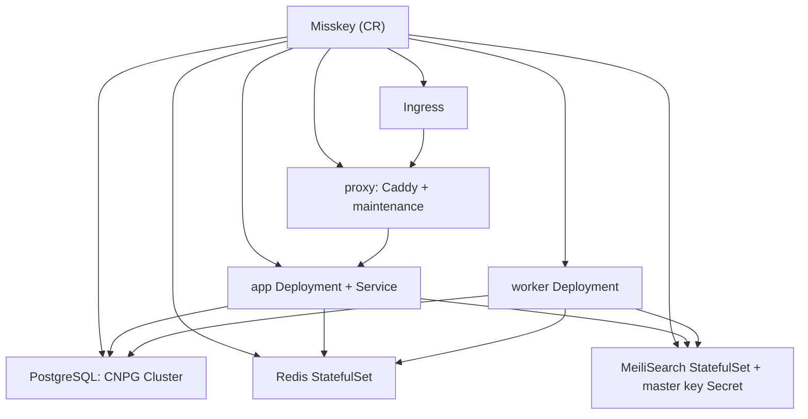

# CloudNativeMisskey

Kubernetes上でMisskeyインスタンスを宣言的に管理するOperatorです。1つの`Misskey`カスタムリソースから、app/worker/proxy/Redis/MeiliSearch/PostgreSQL/Ingressまでを生成します。

全文検索はMeiliSearchを既定にしています。`search.provider`で`sqlPgroonga`/`sqlLike`も選べます。

## アーキテクチャ



## コンポーネント

- **app**(`MK_ONLY_SERVER=true`)と**worker**(`MK_ONLY_QUEUE=true`)は同一imageを共有します。initContainerで`built/`をwritableなemptyDirにコピーし、`default.yml`の`${DB_PASSWORD}`/`${MEILI_KEY}`/`${SETUP_PASSWORD}`をsed展開します。シークレット値はConfigMapには載せません。
- **proxy**はCaddyでappに転送し、backend down時はmaintenanceにfallbackします。`proxy.enabled: false`で無効化でき、そのときIngressはappを直接指します。TLS終端は前段に委ねる前提で、plain HTTPで動きます。
- **Redis**は`redis:7-alpine`を使い、`maxmemory`と`allkeys-lru`を設定します。`redis.external`で外部参照もできます。
- **MeiliSearch**のmaster keyは、未指定なら自動生成して`<name>-meilisearch` Secretに保存します。
- **PostgreSQL**はCNPGの`Cluster`を生成します。app用の認証情報`<name>-db-app` SecretはCNPGが払い出し、Misskeyはそこからパスワードを読みます。`postgres.external`で外部DB参照もできます。

## 前提

| 依存 | 用途 | 必須 |
|---|---|---|
| CloudNativePG operator | `spec.postgres`をCNPGで管理する場合 | DB managed時のみ |
| Ingress controller | `spec.ingress`公開(nginx/traefik等) | ingress有効時のみ |
| RWO StorageClass | Redis/MeiliSearch/PostgreSQLのPVC | managed時のみ |

`postgres.external`/`redis.external`/`search.meilisearch.external`を使えば、これらを外部参照にしてOperator管理から外せます。

## インストール

```bash
# CRD+RBAC+controller managerを一括適用
make deploy IMG=ghcr.io/chan-mai/cloud-native-misskey:v0.1.0
# CRDのみ入れる
make install
```

イメージのbuild/push:

```bash
make docker-build docker-push IMG=ghcr.io/chan-mai/cloud-native-misskey:v0.1.0
```

## 使い方

```bash
kubectl apply -f config/samples/misskey_v1alpha1_misskey.yaml
kubectl get misskey
# NAME      URL                            SEARCH        PHASE     AGE
# example   https://misskey.example.com/   meilisearch   Running   30s
```

`setupPassword`を自動生成させた場合、初回admin登録に使う値は次のように取り出します:

```bash
kubectl -n <namespace> get secret <name>-setup \
  -o jsonpath='{.data.SETUP_PASSWORD}' | base64 -d ; echo
```

最小構成:

```yaml
apiVersion: cloudnative-misskey.dev/v1alpha1
kind: Misskey
metadata:
  name: example
spec:
  url: https://misskey.example.com/
  image: misskey/misskey:2026.6.0
  app: { replicas: 3 }
  worker: { replicas: 2 }
  setupPassword: {}
  search:
    provider: meilisearch
    meilisearch: { storage: 10Gi }
  postgres: { instances: 2 }
  ingress: { className: nginx, host: misskey.example.com }
```

完全な例は[`config/samples/`](config/samples/)を参照してください。`misskey_v1alpha1_misskey.yaml`が全部入り、`_external.yaml`が外部DB/Redis/MeiliSearch参照の例です。

## spec主要フィールド

| フィールド | 既定 | 説明 |
|---|---|---|
| `url` | (必須) | 公開URL。初期化後は変更不可 |
| `image` | (必須) | Misskeyのimage。app/worker共通 |
| `idGenerationMethod` | `aidx` | ID方式。初期化後は変更不可 |
| `setupPassword` | (なし) | 初回admin登録用パスワード。`secretRef`指定か、未指定なら`<name>-setup` Secretへ自動生成 |
| `app.replicas`/`worker.replicas` | 1 | レプリカ数 |
| `search.provider` | `meilisearch` | `meilisearch`/`sqlLike`/`sqlPgroonga` |
| `search.meilisearch.scope` | `local` | `local`(自鯖のみ)/`global`(リモート含む) |
| `search.meilisearch.storage` | `10Gi` | MeiliSearchのPVCサイズ |
| `redis.maxMemory` | `400mb` | Redisの`--maxmemory` |
| `postgres.instances` | 1 | CNPGインスタンス数。2以上でHA |
| `postgres.backup` | (なし) | barmanObjectStoreバックアップ。`schedule`指定でScheduledBackup |
| `proxy.enabled` | `true` | Caddy proxyの有無 |
| `ingress.className` | `nginx` | ingressClassName |
| `extraConfig` | (なし) | `default.yml`末尾に追記する生YAML |

## GitOpsでの利用

ArgoCDやFlux等で配布する場合、Operator本体(`config/default`相当)を1つのApplication/Kustomizationとして同期し、各インスタンスは`Misskey` CRを1枚commitするだけで済みます。DBパスワードや`setupPassword`、S3バックアップ認証はSecretで供給し、外部シークレット管理ツールと組み合わせれば平文をgitに置かずに済みます。

## 検索プロバイダについて

- `search.provider`で`meilisearch`(既定)/`sqlPgroonga`/`sqlLike`を選びます。`meilisearch`選択時のみ、MeiliSearch StatefulSetとmaster key Secretを生成します。
- `sqlPgroonga`を使う場合は、`postgres.imageName`にPGroonga拡張入りのimageを指定します(既定のCNPG imageには含まれません)。managed DBなら、operatorがinitdb時に`CREATE EXTENSION pgroonga`を実行します。
- `CREATE EXTENSION`はinitdb時のみです。作成後に`sqlPgroonga`へ切り替えても拡張は作られず、CNPGのbootstrapはimmutableなためreconcileエラーになりえます。`sqlPgroonga`はインスタンス作成時に選んでください。
- ただし`note`テーブルはMisskeyのmigration後に作られるため、PGroonga indexは初回起動後に管理者が手動で作成する必要があります。Misskeyは自動生成しません([misskey#14730](https://github.com/misskey-dev/misskey/issues/14730)):

  ```sql
  CREATE INDEX idx_note_text_with_pgroonga ON note USING pgroonga (text);
  ```
- noteの検索インデックス構築は、Misskeyのadmin UI(コントロールパネル → その他 → データベース再構築)またはjobで実行します。Operatorは検索基盤の用意までを担当します。

## 開発

```bash
make manifests   # CRD/RBAC再生成
make generate    # DeepCopy再生成
make build       # bin/manager
make run         # kubeconfigのクラスタに対してローカル実行
make fmt vet
```

## 制限事項/TODO

- CNPGの`Cluster`はServer-Side Applyで管理し、CNPG側が補完したフィールドは保持します。ただしCNPG Clusterをwatchしていないため、外部ドリフトの是正は次回reconcile/resync時になります。
- statusはappの可用性で`Ready`/`Phase`を判定します。worker/Redis/MeiliSearch/DBの集約までは行いません。
- `url`/`idGenerationMethod`のimmutable検証を行うvalidating webhookは未実装です。
- MeiliSearchは公式に水平スケール機構がないため、単一レプリカで動かします。
- シークレットの値だけを更新(ローテーション)してもPodは再起動しません。ローリング判定のchecksumはプレースホルダ入りの`default.yml`本文基準で、値の変化を見ないためです。参照Secretの`resourceVersion`をchecksumに含める拡張は可能です。
- メンテナンス応答は既定HTTP 200のため、外形監視は実ステータスを返す`/api/*`を対象にしてください。
- Caddyの`trusted_proxies`は`private_ranges`固定です。前段が非private(cluster外のCloudflare等)なら実CIDRに合わせた調整が要ります。
- initContainerが起動毎に`built/`(数百MB規模)をコピーするため、起動レイテンシに影響します。
