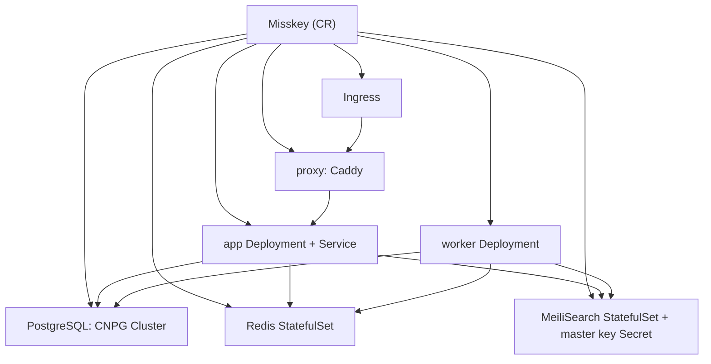

# CloudNative Misskey

Kubernetes上でMisskeyインスタンスを宣言的に管理するOperatorです。1つの`Misskey`カスタムリソースから、app/worker/proxy/Redis/MeiliSearch/PostgreSQL/Ingressまでを生成します。

全文検索はMeiliSearchを既定にしています。`search.provider`で`sqlPgroonga`/`sqlLike`も選べます。

## アーキテクチャ



## コンポーネント

- **app**(`MK_ONLY_SERVER=true`)と**worker**(`MK_ONLY_QUEUE=true`)は同一imageを共有します。initContainerで`built/`をwritableなemptyDirにコピーし、`default.yml`の`${DB_PASSWORD}`/`${MEILI_KEY}`/`${REDIS_PASSWORD}`系/`${SETUP_PASSWORD}`をNodeスクリプトのリテラル置換(JSON quote)で展開します。シークレット値はConfigMapに載らず、改行や`#`等を含む値でもYAMLとして安全です。
- **proxy**はCaddyでappに転送し、backend down時はproxy自身の`file_server`でメンテナンスページを配信します(`/api/*`以外は既定200、`/api/*`は実バックエンドstatusを返し外形監視を妨げない)。`proxy.enabled: false`で無効化でき、そのときIngressはappを直接指します。TLS終端は前段に委ねる前提で、plain HTTPで動きます。
- **Redis**は`redis:8-alpine`(Redis 8を要件とする)を使い、`maxmemory`(既定400mb)と`maxmemory-policy`(既定`noeviction`)を設定し、job queue耐久化のためAOFを既定で有効にします。`redis.external`で外部参照もできます。
- **MeiliSearch**のmaster keyは、未指定なら自動生成して`<name>-meilisearch` Secretに保存します。
- **PostgreSQL**はCNPGの`Cluster`を生成します。app用の認証情報`<name>-db-app` SecretはCNPGが払い出し、Misskeyはそこからパスワードを読みます。`postgres.external`で外部DB参照もできます。

## 前提

| 依存 | 用途 | 必須 |
|---|---|---|
| CloudNativePG operator | `spec.postgres`をCNPGで管理する場合 | DB managed時のみ |
| OT-CONTAINER-KIT redis-operator | `spec.redis.ha`のSentinel HA | redis HA有効時のみ |
| KEDA | `spec.worker.autoscaling.queues`のキュー深度スケール | worker queueスケール時のみ |
| metrics-server | `spec.app.autoscaling`のCPU/memory HPA | app HPA有効時のみ |
| Prometheus Operator | `spec.monitoring`のServiceMonitor/PodMonitor | monitoring有効時のみ |
| Ingress controller | `spec.ingress`公開(nginx/traefik等) | ingress有効時のみ |
| RWO StorageClass | Redis/MeiliSearch/PostgreSQLのPVC | managed時のみ |

`postgres.external`/`redis.external`/`search.meilisearch.external`を使えば、これらを外部参照にしてOperator管理から外せます。

redis-operatorとKEDAはCNPG同様に別途インストールします:

```bash
helm install redis-operator ot-helm/redis-operator -n redis-operator --create-namespace
helm install keda kedacore/keda -n keda --create-namespace
```

> [!IMPORTANT]
> network isolation併用時、`network.isolation.enabled=true`(既定)のままredis HAやworker queueスケールを使う場合、redis-operator/KEDAがredisへ到達できるよう、それらのnamespaceを`spec.network.isolation.allowedNamespaces`に必ず含めてください。未設定だとoperator/KEDAがredisに届かずHA/スケールが立ち上がりません。managed HA redisはrequirepass認証も付くため、network到達可否に関わらずデータ自体は保護されます。

## インストール

```bash
# リリース添付のinstall manifestを直接適用(CRD+RBAC+controller manager)
kubectl apply -f https://github.com/chan-mai/cloudnative-misskey/releases/latest/download/install.yaml
# webhook入り(cert-manager必須)
kubectl apply -f https://github.com/chan-mai/cloudnative-misskey/releases/latest/download/install-webhook.yaml
```

install manifestのoperator imageは`vX.Y.Z@sha256:...`のdigest固定です。タグの打ち直しに影響されず、applyしたものが常にそのリリースのバイナリになります。`ghcr.io/...:latest`タグも存在しますが検証用で、本番デプロイにはversion tag(=リリースmanifest)を使ってください。

ソースからの適用:

```bash
# CRD+RBAC+controller managerを一括適用
make deploy IMG=ghcr.io/chan-mai/cloudnative-misskey:v0.2.0
# CRDのみ入れる
make install
```

イメージのbuild/push:

```bash
make docker-build docker-push IMG=ghcr.io/chan-mai/cloudnative-misskey:v0.2.0
```

## 使い方

```bash
kubectl apply -f config/samples/misskey_v1beta1_misskey.yaml
kubectl get misskey
# NAME      URL                            SEARCH        PHASE     READY   AGE
# example   https://misskey.example.com/   meilisearch   Running   True    30s
```

`phase`は`Progressing`(subsystem未達)/`Running`(全達)/`Error`(reconcile失敗)の3値です。詳細な条件は`conditions`(`DatabaseReady`/`RedisReady`/`SearchReady`/`MigrationComplete`/`AppReady`/`WorkerReady`/`ProxyReady`/`IngressReady`と集約`Ready`)で確認します。解決済みの接続先は`kubectl get misskey -o wide`(`Database`/`Index`列)か`status`(`databaseHost`/`redisHost`/`searchIndex`)に出ます:

```bash
kubectl get misskey example -o jsonpath='{.status.databaseHost}{"\n"}'
# example-db-pooler-rw   (pooler有効時。無効なら例-db-rw、externalならそのhost)
```

`setupPassword`を自動生成させた場合、初回admin登録に使う値は次のように取り出します:

```bash
kubectl -n <namespace> get secret <name>-setup \
  -o jsonpath='{.data.SETUP_PASSWORD}' | base64 -d ; echo
```

最小構成:

```yaml
apiVersion: cloudnative-misskey.dev/v1beta1
kind: Misskey
metadata:
  name: example
spec:
  url: https://misskey.example.com/
  image: misskey/misskey:2026.6.0
  app: { replicas: 3 }
  worker: { replicas: 2 }
  setupPassword: {}
  search:
    provider: meilisearch
    meilisearch: { storage: 10Gi }
  postgres: { instances: 2 }
  ingress: { className: nginx, host: misskey.example.com }
```

完全な例は[`config/samples/`](config/samples/)を参照してください。`misskey_v1beta1_misskey.yaml`が全部入り、`_external.yaml`が外部DB/Redis/MeiliSearch参照の例です。

## spec主要フィールド

| フィールド | 既定 | 説明 |
|---|---|---|
| `url` | (必須) | 公開URL。初期化後は変更不可 |
| `image` | (どちらか必須) | Misskeyのimage。app/worker共通。`imageFrom`と排他 |
| `trackImageDigest` | `false` | imageのタグをレジストリでdigest解決しpodを`image@digest`にpin、定期再解決(5分TTL)する。`:latest`等のmutableタグへの再pushを検知してapp/workerを自動ロール。private registryは`imagePullSecrets`で認証。offの場合はdigest付き参照を推奨(タグ打ち直しは検知されない) |
| `imageFrom.channel` | (どちらか必須) | `MisskeyChannel`からimageを解決し段階ロールアウトに追従。詳細は[fleetのimage管理](#fleetのimage管理misskeychannel) |
| `idGenerationMethod` | `aidx` | ID方式。初期化後は変更不可 |
| `deletionPolicy` | `Retain` | CR削除時のデータ資源(CNPG/Redis/Meili/生成key Secret)の扱い。既定`Retain`はownerRefを外しデータ保持(同名CR再作成で再adopt)。`Delete`でDB含め全GC(破壊的)。**注意: 既定は以前`Delete`。誤削除でのDB全損を防ぐため`Retain`へ変更** |
| `suspend` | `false` | インスタンス休止。app/workerを0にしmigration等のJob新規作成を停止、proxy/DB/Redis/Meiliは稼働継続で訪問者にはメンテページが出る。phaseは`Suspended` |
| `tenant` | namespace名 | 全リソース/podに付く`cloudnative-misskey.dev/tenant`ラベル値。ログ/メトリクスのテナント振り分け用。初期化後は変更不可 |
| `setupPassword` | (なし) | 初回admin登録用パスワード。`secretRef`指定か、未指定なら`<name>-setup` Secretへ自動生成 |
| `app.replicas`/`worker.replicas` | 1 | レプリカ数(autoscaling有効時は無視) |
| `app.autoscaling`/`worker.autoscaling` | (なし) | オートスケール。詳細は[スケーリング](#スケーリングオートスケール) |
| `search.provider` | `meilisearch` | `meilisearch`/`sqlLike`/`sqlPgroonga` |
| `search.meilisearch.scope` | `local` | `local`(自鯖のみ)/`global`(リモート含む) |
| `search.meilisearch.storage` | `10Gi` | MeiliSearchのPVCサイズ |
| `redis.maxMemory` | `400mb` | Redisの`--maxmemory` |
| `redis.maxMemoryPolicy` | `noeviction` | `--maxmemory-policy`。queue保護のため既定noeviction。純cache用途なら`allkeys-lru`推奨(下記ロール分離参照) |
| `redis.ha` | (なし) | Sentinel HA(opt-in)。redis-operator必須。requirepass認証+専用NP付き。詳細は[Redis HA/ロール分離](#redis-haロール分離) |
| `redis.roles` | (なし) | `jobQueue`/`pubsub`/`timelines`/`reactions`を役割別Redisに分離(opt-in) |
| `postgres.instances` | 1 | CNPGインスタンス数。2以上でHA |
| `postgres.readOffload` | instances>=2で自動 | replicaへread振り分け(`dbReplications`)。`false`でopt-out |
| `postgres.pooler` | (なし) | CNPG PgBouncer pooler(rw/ro)をopt-inで前段化 |
| `postgres.backup` | (なし) | barmanObjectStoreバックアップ。`schedule`指定でScheduledBackup。`serverName`でアーカイブフォルダ名を上書き(復元先での衝突回避用) |
| `postgres.recovery` | (なし) | 既存バックアップからのbootstrap復元(DR/移行)。CR作成時のみ有効・immutable。詳細は[バックアップからの復元](#バックアップからの復元drインスタンス移行) |
| `postgres.import` | (なし) | 稼働中の外部PostgreSQLからの論理インポート(pg_dump/pg_restore)。CR作成時のみ有効・immutable。recoveryと排他 |
| `migration.createIndexConcurrently` | `false` | `true`で`MISSKEY_MIGRATION_CREATE_INDEX_CONCURRENTLY=1`。note等の巨大表index作成の書込ロックを避ける(opt-in) |
| `migration.preBackup` | `false` | image変更ごとのmigration前にon-demand CNPG Backupを取り、完了までmigrationをgate(opt-in)。失敗した一方向migrationを`postgres.recovery`で巻き戻せる状態を担保。managed DB+`postgres.backup`必須 |
| `proxy.enabled` | `true` | Caddy proxyの有無 |
| `ingress.className` | `nginx` | ingressClassName |
| `ingress.issuerRef` | (なし) | cert-manager連携。`{name, kind(既定ClusterIssuer)}`を指定するとissuer annotationとTLS block(secret `<name>-tls`, `tlsSecretName`で上書き可)を自動設定。cert-manager必須 |
| `network.isolation.enabled` | `true` | backend(app/worker/redis/meili)へのingressをintra-instanceに限る。公開入口(proxy)とpostgres(CNPGに委任)は対象外 |
| `network.isolation.allowedNamespaces` | (なし) | backendへの到達を追加で許すnamespace名。監視namespaceからのscrape等 |
| `network.egressIsolation.enabled` | `false` | egress隔離(opt-in)。app/workerはpublic可、他backendはintra+DNSのみ。postgresは除外 |
| `network.egressIsolation.dnsNamespace` | `kube-system` | egress隔離時に`:53`を許すDNS namespace |
| `tenancy.dedicated` | `false` | namespace占有宣言。`quota`(ResourceQuota)/`limitRange`(LimitRange)生成の前提 |
| `monitoring.enabled` | `false` | PostgreSQL/Redis/MeiliSearch/proxy(Caddy)のServiceMonitor/PodMonitorを生成(opt-in, Prometheus Operator必須)。Redisはexporter、Meiliは`/metrics`を自動有効化。proxyはCaddyのHTTPメトリクス(RPS/レイテンシ/ステータス)を`:9180/metrics`で公開。`monitoring.labels`でPrometheus selector合わせ |
| `monitoring.rules` | 有効時on | 基本アラートのPrometheusRule(`<name>-alerts`)を生成。proxy 5xx比率>5%と、backup設定時は最新バックアップの鮮度(`backupMaxAge`既定48h)。`rules.enabled: false`でopt-out |
| `objectStorage` | (なし) | S3/R2互換media storage(opt-in)。DBのmetaテーブルへ書込むため詳細は[オブジェクトストレージ](#オブジェクトストレージmedia) |
| `performance` | (Misskey既定) | job queueチューニング。`deliverJobConcurrency`/`inboxJobConcurrency`/`deliverJobPerSec`/`inboxJobPerSec`/`relationshipJobPerSec`/`deliverJobMaxAttempts`/`inboxJobMaxAttempts`。未設定キーは`default.yml`に出さずMisskey既定に委ねる |
| `outboundProxy` | (なし) | 外向きforward proxy。`http`(→`proxy`)/`smtp`(→`proxySmtp`)/`bypassHosts`(→`proxyBypassHosts`)。`spec.proxy`(前段Caddy)とは別 |
| `files.maxFileSize` | (Misskey既定) | アップロード上限(bytes) |
| `files.mediaProxy` | (なし) | リモートファイルのmedia proxy URL |
| `files.proxyRemoteFiles` | `true` | リモートファイルを自鯖経由でproxy |
| `extraConfig` | (なし) | `default.yml`末尾に追記する生YAML |

`performance`/`outboundProxy`/`files`は`default.yml`のキーをそのまま第一級化したものです。設定したキーのみ出力し、未設定なら従来どおりMisskey既定に委ねます(既存の描画結果は不変)。`proxyRemoteFiles`も従来固定`true`から`files.proxyRemoteFiles`で上書き可能になりました(既定`true`で挙動不変)。

SMTP(送信メール)やcaptchaは`default.yml`でなくDBの`meta`テーブル管理(objectStorageと同方式)のため、ここではモデル化していません。管理画面で設定してください。

## フォークイメージ

`spec.image`にフォークのimageを指定すれば、(構造がupstream準拠の物に限り)Misskey系フォークがそのまま動作します。固有のconfigキーは`extraConfig`で追加可能です。

image契約(uid/コマンド/パス/health)がupstreamと異なるフォークは`spec.runtime`で上書きします。全て任意で、既定はupstream `misskey/misskey`です。

| `runtime`フィールド | 既定 | 用途 |
|---|---|---|
| `runAsUser` | `991` | コンテナuid |
| `startCommand` | `["pnpm","run","start"]` | app/worker起動コマンド |
| `migrateCommand` | `["pnpm","run","migrate"]` | migration Jobコマンド |
| `healthPath` | `/api/server-info` | probeパス |
| `configPath` | `/misskey/.config/default.yml` | `default.yml`のmount先 |
| `builtPath` | `/misskey/built` | `built/`のwritableコピー先。空文字でコピー無効 |

例(uidと起動コマンドが異なるフォーク):

```yaml
spec:
  image: ghcr.io/example/misskey-fork:1.0.0
  runtime:
    runAsUser: 1000
    startCommand: ["node", "packages/backend/built/entry.js"]
```

設定描画は常にMisskeyの`default.yml`形式です。またrender initはimage内のnodeを使うため、nodeを持たないimageには対応しません。

## GitOpsでの利用

ArgoCDやFlux等で配布する場合、Operator本体(`config/default`相当)を1つのApplication/Kustomizationとして同期し、各インスタンスは`Misskey` CRを1枚commitするだけで済みます。DBパスワードや`setupPassword`、S3バックアップ認証はSecretで供給し、外部シークレット管理ツールと組み合わせれば平文をgitに置かずに済みます。

## 検索プロバイダについて

- `search.provider`で`meilisearch`(既定)/`sqlPgroonga`/`sqlLike`を選びます。`meilisearch`選択時のみ、MeiliSearch StatefulSetとmaster key Secretを生成します。
- `sqlPgroonga`を使う場合は、`postgres.image`にPGroonga拡張入りのimageを指定します(既定のCNPG imageには含まれません)。managed DBなら、operatorがinitdb時に`CREATE EXTENSION pgroonga`を実行します。
- `CREATE EXTENSION`はinitdb時のみです。作成後に`sqlPgroonga`へ切り替えても拡張は作られず、CNPGのbootstrapはimmutableなためreconcileエラーになりえます。`sqlPgroonga`はインスタンス作成時に選んでください。
- ただし`note`テーブルはMisskeyのmigration後に作られるため、PGroonga indexは初回起動後に管理者が手動で作成する必要があります。Misskeyは自動生成しません([misskey#14730](https://github.com/misskey-dev/misskey/issues/14730)):

  ```sql
  CREATE INDEX idx_note_text_with_pgroonga ON note USING pgroonga (text);
  ```
- noteの検索インデックス構築は、Misskeyのadmin UI(コントロールパネル → その他 → データベース再構築)またはjobで実行します。Operatorは検索基盤の用意までを担当します。

## Redis HA・ロール分離

`spec.redis`は既定で単一podのStatefulSet(requirepass認証+NetworkPolicyでapp/workerのみ許可)です。managed redisは常時認証で、operatorが`<name>-redis-auth` Secretにrandom passwordを生成し`--requirepass`を設定します。値はSecret参照でpodに注入し、default.yml・pod specのどちらにも平文で載りません。大規模向けに次のopt-inがあります。

### Sentinel HA (`redis.ha`)

redis-operator(OT-CONTAINER-KIT)でprimary+replica+Sentinelを構成し、自動failoverでSPOFを解消します。MisskeyはSentinel経由で接続します。

```yaml
spec:
  redis:
    ha:
      replicas: 3    # redisノード数(1 primary + 2 replica)
      sentinels: 3   # sentinel数(quorum用に奇数)
  network:
    isolation:
      allowedNamespaces: [redis-operator, keda]  # operator/KEDAのredis到達に必須
```

- **認証**: operatorが`<name>-redis-auth` Secretにrandom passwordを生成し、Redis/Sentinel両方に`requirepass`を設定します。任意podからの無認証read/writeを防ぎます。
- **隔離**: HA redis/sentinel podはoperator管理でinstance labelを持たず、通常の`network.isolation`のNPに乗りません。その穴を埋める専用NP(`<name>-redis-ha`、app/worker+intra-HA+`allowedNamespaces`のみ許可)を`network.isolation.enabled`と連動して生成します。standalone redisは`network.isolation`のNPとrequirepass認証の両方で保護します。
- **前提**: redis-operatorのインストールと、network isolation有効時は`allowedNamespaces`にredis-operator(+KEDA)のnamespaceを含めること(前提節参照)。

### 役割別分離 (`redis.roles`)

BullMQ job queue/pubsub/timeline/reactionを役割別Redisに分けて、単一coreのボトルネックを緩和します。未指定の役割は共有redisにfallbackします。各役割は専用managedインスタンスかexternal参照を選べます。HAは役割ごとに独立で、`redis.ha`は共有default redis専用です(役割は自分の`ha`を持つときだけHA)。

```yaml
spec:
  redis:
    ha: {}               # 共有default redisをHAに
    roles:
      jobQueue: { ha: {} } # 専用managed HA
      pubsub: {}           # 専用managed standalone(haを持たない)
      # timelines/reactions未指定 → 共有redisにfallback
```

**maxMemoryPolicy指針**: job queueは`noeviction`(既定。maxmemory到達でevictするとジョブ消失)。純cache用途(timelines等)は`allkeys-lru`が適します。役割別に`redis.roles.<role>.maxMemoryPolicy`で上書きできます。

## スケーリング(オートスケール)

`app.replicas`/`worker.replicas`は固定値です。`autoscaling`を設定するとreplicasはautoscalerが管理します(operatorはreplicasを触りません)。PodDisruptionBudget(maxUnavailable=1)との整合上、`minReplicas>=2`を推奨します。

### app: HPA (CPU/memory)

native HorizontalPodAutoscaler(`autoscaling/v2`)を生成します。metrics-serverが要ります。

```yaml
spec:
  app:
    autoscaling:
      minReplicas: 2
      maxReplicas: 10
      targetCPUUtilizationPercentage: 70   # 省略時はCPU 80%
      # targetMemoryUtilizationPercentage: 80
```

### worker: KEDA (キュー深度)

`queues`を指定するとKEDA ScaledObjectでBullMQ待ちリスト深度をスケール指標にします。連合配送(`deliver`)/受信(`inbox`)が伸縮点です。KEDAとjobQueue redisへの到達(`allowedNamespaces`)が要ります。

```yaml
spec:
  worker:
    autoscaling:
      minReplicas: 2
      maxReplicas: 20
      queues:
        - name: deliver
          listLength: 1000   # replicaあたりの目標待ち数
        - name: inbox
          listLength: 500
```

- 監視Redisキーは`<url host>:queue:<queue>:<queue>:wait`を自動算出します。プレフィックスが異なる場合は`queues[].listName`で上書きできます。
- HA redis(Sentinel+auth)の場合、operatorがsentinel/passwordのTriggerAuthenticationを自動生成します。

### app: RPSベース (`autoscaling.rps`)

前段proxyのリクエストレートでappをスケールします(KEDA prometheus trigger)。`monitoring.enabled`でCaddyメトリクスがscrapeされていることが前提です(未設定なら警告)。

```yaml
spec:
  monitoring: { enabled: true }
  app:
    autoscaling:
      minReplicas: 2
      maxReplicas: 10
      rps:
        serverAddress: http://prometheus-operated.monitoring:9090
        targetRPS: 50   # 1レプリカあたりの目標RPS
        # query: 独自PromQLで上書き可(既定は自インスタンスのproxy合計RPS)
      targetCPUUtilizationPercentage: 80  # 任意, cpu floorとして併存
```

## fleetのimage管理(MisskeyChannel)

複数インスタンスを運用する場合、cluster-scopedの`MisskeyChannel`でimageを一元管理し、`spec.imageFrom.channel`で参照させると段階ロールアウトができます。

```yaml
apiVersion: cloudnative-misskey.dev/v1beta1
kind: MisskeyChannel
metadata:
  name: stable
spec:
  image: misskey/misskey:2026.6.0
  rollout:
    batchPercent: 20  # interval毎に20%ずつ切替
    interval: 1h
---
apiVersion: cloudnative-misskey.dev/v1beta1
kind: Misskey
spec:
  imageFrom: { channel: stable }  # imageの代わりに指定(排他)
```

channelの`image`を更新すると、各インスタンスはnamespace/名前のハッシュで0-99の固定バケットに割当てられ、`interval`ごとに`batchPercent`分のバケットが新imageへ切替わります(migration→app/workerロールの通常経路)。進捗は`kubectl get mkch`のInstances/Updated列と各Misskeyの`status.image`で確認できます。

- `rollout`省略時は即時全量。初回のimage設定も即時です
- `trackImageDigest: true`でchannelの`image`をdigest解決して配信します。`:latest`等のmutableタグへの再pushも「image変更」として検知され、**同一タグのまま段階ロールアウトに乗ります**。channelの解決はanonymousアクセスのみ(private registryはインスタンス側の`trackImageDigest`+`imagePullSecrets`か、digest付き参照を使用)
- ロールアウト中にさらにimageを変えた場合、未切替インスタンスは新しいimageへ直接ジャンプします(2世代は追跡しない)
- 参照先channelが存在しないとそのインスタンスはPhase=Errorになります
- 切替の反映粒度はreconcile周期(既定でready時3分)です

## オブジェクトストレージ(media)

`spec.objectStorage`でS3/R2互換のmedia storageを設定します(opt-in)。Misskeyのobject storage設定は`default.yml`になくDBの`meta`テーブルに入るため、operatorはmigration完了後・app/worker起動前に**psqlでmetaへ書き込む使い捨てJob**を挟みます(`autoConfigure`既定true)。書込はprimaryへ直結し、値は環境変数経由でpsqlが安全にquoteするため、資格情報やbucket名がSQL本文・コマンドライン引数に露出しません。

Cloudflare R2の例:

```yaml
spec:
  objectStorage:
    bucket: my-misskey-media
    endpoint: <accountid>.r2.cloudflarestorage.com  # schemeは付けない
    region: auto                                     # R2は空不可
    baseUrl: https://media.example.com               # R2は公開ドメイン必須(S3 APIエンドポイントは非公開)
    setPublicRead: false                             # R2はACL非対応。必ずfalse(既定)
    # s3ForcePathStyle: true (既定)、useSSL: true (既定)
    credentials:
      accessKeyId:     { name: r2-credentials, key: ACCESS_KEY_ID }
      secretAccessKey: { name: r2-credentials, key: SECRET_ACCESS_KEY }
```

- **既存ファイルは移行されません。** 設定は新規アップロードにのみ適用されます(Misskey本体が移行機構を持たない)。初期セットアップ直後の設定を推奨します。
- **設定変更時はapp/worker podがrollします。** DB直書きはMisskeyのmeta更新イベント(Redis pub/sub)を発火しないため、稼働中podの古いmeta cacheを畳むべくpodテンプレートのchecksumに設定を織り込んでいます。短時間の再起動が起きます。
- **無効化はコントロールパネルで。** `objectStorage`ブロックを外すとoperatorはJob/SQL ConfigMapを掃除しますが、metaは触りません(`useObjectStorage=false`へ戻すと既存S3ファイルの配信が壊れる破壊的操作のため)。
- **`autoConfigure: false`** にすると、値は宣言しつつoperatorはDBに一切触れません。metaへの投入は自分で行ってください(GitOpsで手動管理したい場合等)。
- **カラム名のカスタマイズ**: フォークや旧バージョンで`meta`のカラム名が異なる場合、`columnNames`で標準13カラムの識別子を個別に上書きできます。モデル化されていないfork固有カラムは`extraColumns`(平文値のみ、秘密は`credentials`へ)で追加できます。識別子は`^[A-Za-z_][A-Za-z0-9_]*$`に制限されます。
- **psqlイメージ依存**: meta書込Jobは既定でCNPGのPostgreSQLイメージ(psql同梱)を使います。`objectStorage.image`で上書き可能ですが、`\getenv`を使うためpsql 16以上が必要です。

## バックアップからの復元(DR/インスタンス移行)

`spec.postgres.recovery`で、`postgres.backup`が書き出したbarmanObjectStoreバックアップからDBをbootstrap復元できます(CNPGの`bootstrap.recovery`)。**復元=新しいCRの作成**です。既存インスタンスのDBを入れ替えるin-place復元機構はありません。

```yaml
spec:
  postgres:
    recovery:
      source:
        destinationPath: s3://my-bucket/misskey/backups
        endpointURL: https://s3.example.com
        serverName: old-instance-db   # 復元元のフォルダ名(通常"<旧CR名>-db")
        s3Credentials:
          accessKeyId:     { name: s3-credentials, key: ACCESS_KEY_ID }
          secretAccessKey: { name: s3-credentials, key: SECRET_ACCESS_KEY }
      targetTime: "2026-07-15T00:00:00+09:00"  # 任意(PITR)。省略で最新WALまで
```

復元完了後はCNPGが`<name>-db-app` Secretを生成しownerパスワードを整合させるため、そのままmigration Job → app/worker起動という通常のライフサイクルに乗ります。

- **recoveryはCR作成時のみ有効・immutable。** CNPGはbootstrapをCluster作成時にしか評価しないため、作成後の追加・変更・削除はCELが拒否します。復元済みインスタンスのmanifestにrecoveryブロックを残したままにしてください(出自の宣言としてgitに残る)。
- **`spec.url`と`spec.idGenerationMethod`は復元元と同一にしてください。** 不一致はfederationとID生成を破壊します(webhook有効時は警告が出ます)。
- **同一バケットへ継続バックアップするなら`backup.serverName`を別名に。** 復元元と同じ`destinationPath`のまま新クラスタがWALアーカイブを始めると復元元アーカイブを上書きするため、CELが`recovery.source.serverName`と異なる`backup.serverName`を強制します。復元後は早めに初回フルバックアップを取ってください。
- **復元されるのはDBのみ。** メディアはobject storage参照なので同一バケットを使い続ければ無傷、MeiliSearchインデックスは再構築、Redisのjob queueは失われます。
- **`<name>-db`のCNPG Clusterが既に存在する場合、recoveryは無視されます**(既存クラスタをadoptするため)。`deletionPolicy: Retain`で残したClusterを同名CRで引き取る運用とは排他です。
- CNPG 1.26でin-tree barmanObjectStoreはdeprecated(Barman Cloud Plugin推奨)。backup/recoveryのplugin移行は今後の課題です。

### バックアップの定期復元検証 (`postgres.backup.verify`)

バックアップは復元してみるまで有効性が分かりません。`verify`を設定すると、`interval`(既定168h)ごとに最新バックアップから使い捨てのCNPG Cluster(`<name>-db-verify`, 1インスタンス、WALアーカイブなし)を起こし、readyに到達したら破棄して結果を`status.backupVerification`に記録します。`timeout`(既定30m)内にreadyにならなければFailedとして記録されます。

```yaml
spec:
  postgres:
    backup:
      destinationPath: s3://my-bucket/misskey/backups
      verify:
        interval: 168h
        timeout: 30m
```

検証Clusterは復元検証専用で、`deletionPolicy: Retain`でも保持されません。ストレージは本体と同サイズのPVCを一時的に消費します。

### 稼働中DBからの論理インポート (`postgres.import`)

バックアップを経由せず、稼働中の外部PostgreSQL(docker compose構成やRDS等)から直接移行する場合は`postgres.import`を使います。CNPGの`initdb.import`(microservice型)によるpg_dump/pg_restoreで、CR作成時にDBを丸ごと取り込みます。

```yaml
spec:
  postgres:
    import:
      source:
        host: old-server.example.internal
        port: 5432
        database: misskey
        user: misskey
        passwordSecret: { name: src-db-secret, key: password }
        sslMode: prefer
```

- recoveryと同じくCR作成時のみ有効・immutable。recoveryとは排他です
- インポート完了まで移行元DBへ到達できる必要があります(NetworkPolicy/FW注意)
- `spec.url`/`spec.idGenerationMethod`は移行元と同一にしてください(recovery同様の警告が出ます)
- 移行元でpgroonga等の拡張を使っている場合、`postgres.image`に拡張入りイメージが必要です

## 開発

```bash
make manifests   # CRD/RBAC再生成
make generate    # DeepCopy再生成
make build       # bin/manager
make run         # kubeconfigのクラスタに対してローカル実行
make fmt vet
make test-e2e    # kind e2e
```

## 制限事項/TODO

- 外部operatorのCRD(CNPGの`Cluster`/`Pooler`、redis-operatorの`RedisReplication`/`RedisSentinel`、KEDAの`ScaledObject`)はServer-Side Applyで管理しますが、watchはしていません。これらを外部から直接削除・改変した場合の是正は、reconcile成功後に定期requeue(既定3分、`--drift-resync-interval`で調整)でSSAを再適用して行います。よってドリフトは最大その間隔で自動是正されます(Deployment/NetworkPolicy/PDB等のnative resourceはOwns()でwatch・即時是正)。
- migration Jobが失敗し切った場合(BackoffLimit超過)、DB接続先やmigrationフラグ等のspec変更時は自動で作り直されます。同一設定のまま再試行するには`kubectl delete job <name>-migrate-<hash>`で削除すると、次のreconcileで再生成されます(同一入力の失敗を無限リトライしないのは、`createIndexConcurrently`失敗時のinvalid index堆積等を避けるためです)。
- `Ready`/`Phase`はDB/Redis/MeiliSearch/migration/app/worker/proxy/Ingressの全conditionsの集約です。managed Redis/MeiliSearchはSTS(HAはpod)のready数、externalは常にTrueとして扱います。
- appのオートスケールはCPU/memory(native HPA)に加え、`autoscaling.rps`でRPSベース(KEDA prometheus trigger)を選べます。rps指定時はKEDA経路になりmemory targetは効きません。
- immutable検証(`url`/`idGenerationMethod`/`tenant`/`postgres.recovery`)とcross-field整合(managed/external排他、pooler/backup/recoveryのmanaged必須、recoveryとbackupのWALアーカイブ衝突防止、autoscaling min<=max、redis role排他)はCRDのCEL(`x-kubernetes-validations`)で**常時**強制します。APIサーバが直接弾くため、webhook未導入でも効きます。
- webhook(`config/default-webhook`、cert-manager必須、opt-in)はCELで表せない補助のみを担います: `tenant`未設定→namespace確定のdefaulting(「未設定→初回設定」の穴塞ぎ)と、エラーにしない警告(external DBで`readOffload`無効、等)。cert-manager無しなら`config/default`(webhook無し)を使います。manager側は`ENABLE_WEBHOOKS=false`が設定済みで、`config/default-webhook`のpatchが`true`へ上書きします。webhook無しの場合`tenant`は生成時に明示してください(defaultingが効かないため)。
- egress隔離は`spec.network.egressIsolation.enabled`でopt-inです(既定off)。有効時、app/workerはDNS+intra-instance+public(RFC1918/CGNAT/link-local除く)、他backendはDNS+intra-instanceのみに制限し、SSRF/横移動を抑止します。app/workerは連合のため外向きpublicは開けるので、目的は外向き遮断ではなく内部到達の遮断です。DNS namespaceは`network.egressIsolation.dnsNamespace`(既定`kube-system`)で指定します。public許可ルールはIPv4のみ対応で、dual-stackクラスタではIPv6のegressは遮断されます(IPv6で連合する場合は注意)。
- PostgreSQL(CNPG)は隔離NetworkPolicyの対象外です。CNPG operatorが別namespaceからinstance manager(:8000)へ接続するため意図的に除外しており、DBのネットワーク保護はCNPG/platform側に委ねます。backend隔離下で監視namespaceからscrapeするには`network.isolation.allowedNamespaces`で明示的に開けてください。
- **オブジェクトストレージ(media)は`spec.objectStorage`で設定できます**([オブジェクトストレージ](#オブジェクトストレージmedia)参照)。未設定時のアップロードファイルはpodローカル(emptyDir)に置かれ、**pod再起動で消え、複数レプリカ間でも共有されません**。よって`app.replicas>1`で運用する場合は`objectStorage`を設定してください。既存アップロード済みファイルは設定後も移行されません(新規アップロードのみ対象)。
- MeiliSearchは公式に水平スケール機構がないため、単一レプリカで動かします。
- 参照Secret(DBパスワード/Meiliキー/Redisパスワード/setupPassword)のローテーションはpodテンプレートのchecksumに反映され、app/worker/失敗中のmigration Jobが自動で追従します。判定はSecretの`resourceVersion`基準のため、値が変わらないmetadata更新でもローリングが起きることがあります。
- **Secretはcluster-wideにlist/watchしません**(全Secretのinformerキャッシュ肥大とRBAC上のlist/watch権限を排し、name指定getのみ)。operator生成/CNPG/ユーザ持込Secretの変更検知はconfig-checksumと定期requeue(`--drift-resync-interval`、既定3分)で反映するため、外部Secret値のローテはpodローリングまで最大その間隔の遅延があります。
- operator生成Secret(setup/redis-auth/meiliキー)は既定で不変です。ローテーションはCRに`cloudnative-misskey.dev/rotate: <任意の値>`annotationを付け、値を変えるたびに新しい乱数へ再生成されます(checksum経由でpodが追従)。
- **セキュリティ強化のmanagerフラグ**(いずれも既定は無効=後方互換): `--watch-namespaces`(監視namespaceを限定。namespaced resource(Misskeyと子リソース)はnamespace別RoleBindingで付与できるが、cluster-scopedな`MisskeyChannel`はmisskeychannelsへの`get;list;watch`を持つ小さなClusterRoleが別途必要)、`--allowed-image-registries`(全ユーザ指定imageのレジストリprefix許可リスト、webhookで拒否)、`--allowed-cluster-issuers`(`ingress.issuerRef`のClusterIssuer許可リスト)。Ingress annotationはnginx snippet系/auth系/mirror系を遮断し、operator管理キーはユーザ指定で上書きできません。
- managed redisは常時requirepass認証です。認証を持たない旧版からアップグレードすると、standalone redis STS(command/env変更)とdefault.ymlへの`pass:`追加でredis/app/worker/migrationが一度ローリングします。AOFでデータは保持され、機能的な破壊はありません。
- メンテナンス応答は既定HTTP 200のため、外形監視は実ステータスを返す`/api/*`を対象にしてください。
- Caddyの`trusted_proxies`は`private_ranges`固定です。前段が非private(cluster外のCloudflare等)なら実CIDRに合わせた調整が要ります。
- initContainerが起動毎に`built/`(数百MB規模)をコピーするため、起動レイテンシに影響します。
- backend image既定の固定方針: upstreamがrolling majorタグを出すものは**major float**でpatch/minorに追従します(`caddy:2`/`redis:8-alpine`/CNPG `postgresql:17`/`meilisearch:v1`)。opstree `redis`/`redis-sentinel`(`v8.2.5`)と`redis_exporter`(`v1.62.0`)はupstreamがrolling major/minorを出さないため**patch pin**です(opstreeはredis-operatorのtested版と揃える意味もあり)。既定は時間で古びるので、operatorリリース毎にpinを見直します。再現性重視で全て固定したい場合は各`image`で明示指定してください。
- image既定の適用場所はデータ互換性で分けています。stateful系(`postgres.image`/`redis.image`/`meilisearch.image`/HA image)はCRD defaultとしてCR作成時に永続化され、operatorを更新しても既存インスタンスのmajorは固定のままです。stateless系(`proxy.image`/`monitoring.redisExporterImage`/`objectStorage.image`)はoperator側適用のため、operator更新で全インスタンスに追従します。
- enumのcasingはbackendの実値に合わせています(統一より実値一致を優先): `deletionPolicy`(`Delete`/`Retain`)はk8s慣習のPascalCase、`search.provider`/`postgres.pooler.poolMode`/`search.meilisearch.scope`はMisskey/PgBouncerがそのまま受け取るlowercase値です。
